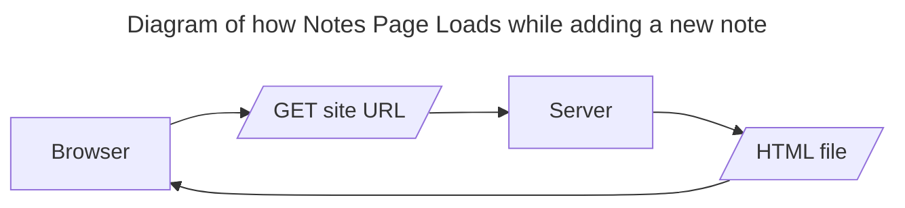
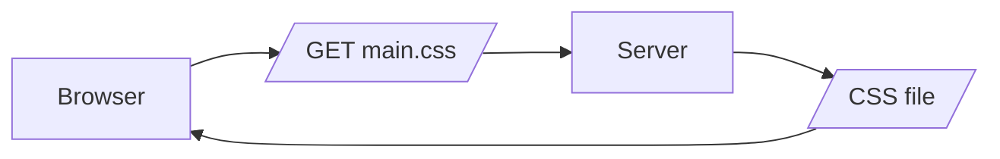
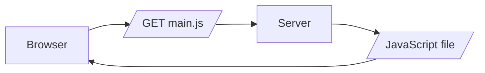
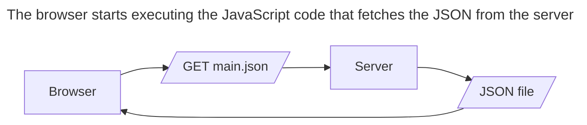
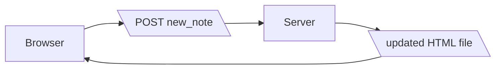

```mermaid
---
title: Diagram of how Notes Page Loads while adding a new note
---
%%{init: {"flowchart": {"htmlLabels": false}} }%%

flowchart LR
  id1[Browser]
  cmd1[/GET site URL/]
  cmd2[/HTML file/]
  id2[Server]
  id1-->cmd1-->id2-->cmd2-->id1

```

```mermaid

flowchart LR
  id1[Browser]
  cmd1[/GET main.css/]
  cmd2[/CSS file/]
  id2[Server]
  id1-->cmd1-->id2
  id2-->cmd2-->id1

```

```mermaid

flowchart LR
  id1[Browser]
  cmd1[/GET main.js/]
  cmd2[/JavaScript file/]
  id2[Server]
  id1-->cmd1-->id2
  id2-->cmd2-->id1

```

```mermaid
 ---
title: The browser starts executing the JavaScript code that fetches the JSON from the server
---
flowchart LR
  id1[Browser]
  cmd1[/GET main.json/]
  cmd2[/JSON file/]
  id2[Server]
  id1-->cmd1-->id2
  id2-->cmd2-->id1

```

---

<b>The browser executes the callback function that renders the notes</b>

---

```mermaid
---
When a new Note is added by the User
---
flowchart LR
  id1[Browser]
  cmd1[\POST new_note\]
  cmd2[\updated HTML file\]
  id2[Server]
  id1-->cmd1-->id2
  id2-->cmd2-->id1

```

---

<h2>Then browser refreshes the page and executes the callback function that renders the notes</h2>
